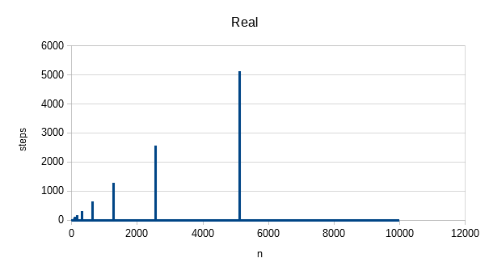
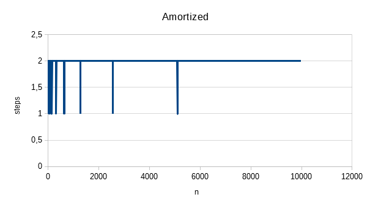

## 2020 Project 2

Εκφώνηση: https://k08.chatzi.org/projects/project2/

### Προσωπικά στοιχεία

__Όνομα__: Αδαμόπουλος Μιχαήλ

__Α.Μ.__: sdi1800003

### Documentation

Συμπληρώστε εδώ __όσο documentation χρειάζεται__ ώστε οι βαθμολογητές να
κατανοήσουν πλήρως τις λύσεις σας και να τις βαθμολογήσουν ανάλογα. Αυτό θα
πρέπει να γίνει ανεξάρτητα με το αν ο κώδικάς σας είναι καλά σχολιασμένος,
πράγμα που συνιστάται.

Άσκηση 1:

Σε real χρόνο παρατηρούμε ότι όλες οι εκτελέσεις γίνονται σε 1 step, εκτός από τις περιπτώσεις που χρείαζεται να κληθεί η
realloc για να αντιγράψει τα προηγούμενα στοιχεία. Σε αυτές τις περιπτώσεις χρειαζόμαστε steps όσο το size του vector την 
στιγμή αυτή(δηλαδή n) συν μία για το νέο insert.

Σε amortized χρόνο παρατηρούμε ότι ο μέσος όρος των steps που χρειάζονται είναι 2. Αυτό προκύπτει καθώς για τις περισσότερες
εκτελέσεις τα steps που χρειάζονται είναι 1, εκτός από κάποιες περιπτώσεις που χρειάζονται n+1 steps. Αυτές οι περιπτώσεις όμως
προκύπτουν αραιά, όταν δηλαδή κάνουμε insert το 10*2^n + 1 στοιχείο. Για παράδειγμα, στις 11(10*2^0 + 1) εκτελέσεις, θα έχουμε
στις 10 πρώτες εκτελέσεις από 10 συνολικά steps και στην 11η άλλα 11, με σύνολο τα 21, όπου 21/11 (=) 2.